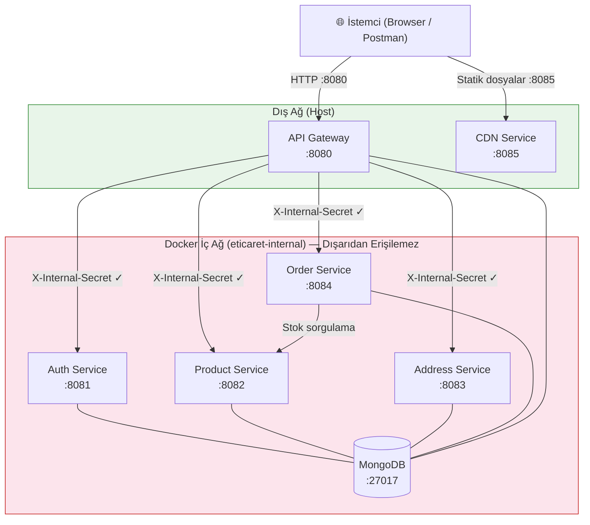
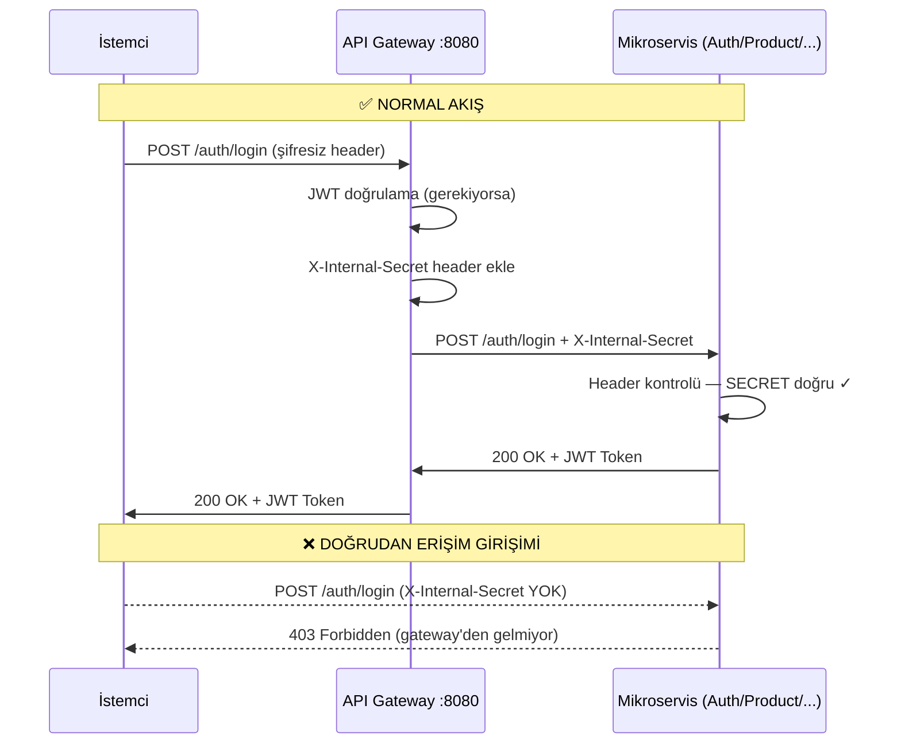
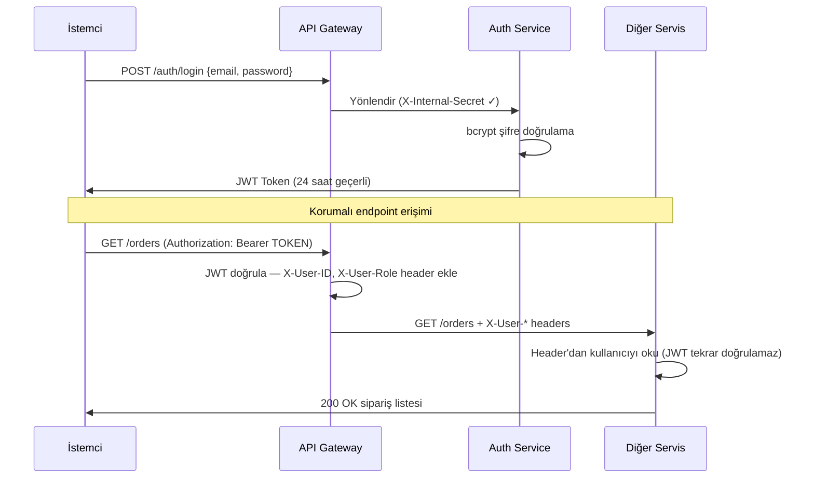
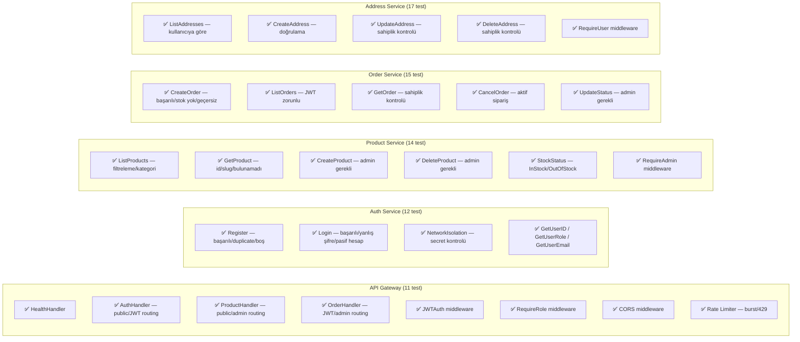
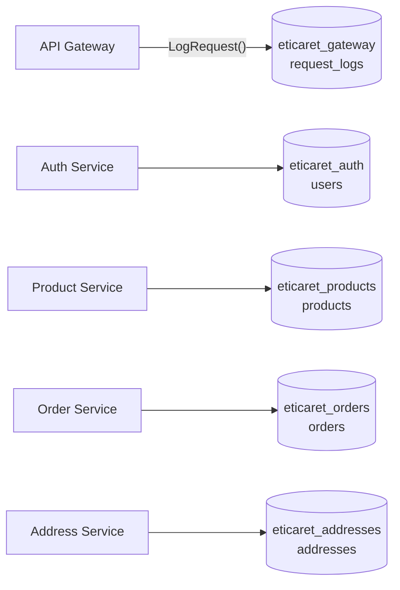
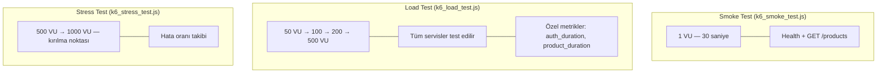

# E-Ticaret Go Mikroservis Backend

PHP monolitik uygulamasından Go mikroservis mimarisine tam dönüşüm.

---

## Mimari Genel Bakış



---

## Ağ İzolasyonu



---

## JWT Kimlik Doğrulama Akışı



---

## Servis Haritası

| Servis | Port | Açıklama | Dış Erişim |
|--------|------|----------|------------|
| **API Gateway** | 8080 | Tek giriş noktası, JWT doğrulama, rate limit | ✅ |
| **Auth Service** | 8081 | Kayıt, giriş, profil | ❌ İç ağ |
| **Product Service** | 8082 | Ürün CRUD, arama, filtreleme | ❌ İç ağ |
| **Address Service** | 8083 | Kullanıcı adresleri | ❌ İç ağ |
| **Order Service** | 8084 | Sipariş yönetimi | ❌ İç ağ |
| **CDN Service** | 8085 | Statik dosya sunucu | ✅ |

---

## TDD — Test Sonuçları



### Test Çalıştırma

```bash
# API Gateway
cd go-backend/api-gateway && go test ./... -v

# Auth Service
cd go-backend/auth-service && go test ./... -v

# Product Service
cd go-backend/product-service && go test ./... -v

# Order Service
cd go-backend/order-service && go test ./... -v

# Address Service
cd go-backend/address-service && go test ./... -v
```

---

## Gateway — İzole MongoDB Veritabanı

Gateway, kendi MongoDB veritabanını kullanır (`eticaret_gateway`). Mikroservislerin veritabanlarından tamamen izoledir.



**Son logları görüntüle:**
```bash
curl http://localhost:8080/gateway/logs?limit=50
```

---

## k6 Yük Testi



**Çalıştırma:**
```bash
# Docker ile (önerilen)
docker compose --profile loadtest run k6 run /scripts/k6_smoke_test.js
docker compose --profile loadtest run k6 run /scripts/k6_load_test.js
docker compose --profile loadtest run k6 run /scripts/k6_stress_test.js

# Yerel k6 ile
k6 run load-tests/k6_smoke_test.js
```

---

## Proje Klasör Yapısı

```
go-backend/
├── api-gateway/                  # Port 8080 — Tek genel giriş noktası
│   ├── cmd/main.go               # Giriş noktası, route tanımları
│   ├── internal/
│   │   ├── handler/              # Auth/Product/Order/Health handler'ları
│   │   ├── middleware/           # CORS, JWT, RequireRole, RequestLoggerWithStore
│   │   ├── ratelimit/            # Token bucket rate limiter
│   │   └── store/                # Gateway izole MongoDB store
│   ├── Dockerfile
│   └── go.mod
│
├── auth-service/                 # Port 8081
│   ├── cmd/main.go
│   ├── internal/
│   │   ├── handler/              # Register, Login, Profile
│   │   ├── middleware/           # NetworkIsolation, GetUserID/Role/Email
│   │   ├── model/                # User, LoginRequest, AuthResponse
│   │   ├── repository/           # MongoDB erişimi
│   │   └── service/              # bcrypt, JWT üretimi
│   └── tests/                    # Entegrasyon testleri
│
├── product-service/              # Port 8082
│   ├── internal/
│   │   ├── handler/              # CRUD + arama + featured
│   │   ├── middleware/           # NetworkIsolation, RequireAdmin
│   │   ├── model/                # Product, Category, Filter
│   │   ├── repository/           # Filtreli MongoDB sorguları
│   │   └── service/
│   └── tests/
│
├── address-service/              # Port 8083
│   ├── internal/                 # CRUD + sahiplik kontrolü
│   └── tests/
│
├── order-service/                # Port 8084
│   ├── internal/                 # CRUD + stok kontrolü (→ product-service)
│   └── tests/
│
├── cdn-service/                  # Port 8085 — Statik dosya sunucu
│   └── static/                   # Ürün görselleri
│
├── shared/                       # Tüm servisler tarafından kullanılan
│   ├── jwt/                      # Token üretimi ve doğrulaması
│   ├── response/                 # Standart JSON yanıtlar
│   └── logger/                   # Yapılandırılmış JSON logger
│
├── load-tests/                   # k6 yük test scriptleri
│   ├── k6_smoke_test.js
│   ├── k6_load_test.js
│   ├── k6_stress_test.js
│   └── results/
│
└── docker-compose.yml
```

---

## Çalıştırma

### Docker ile (Önerilen)
```bash
cd go-backend
cp .env.example .env      # Değişkenleri düzenle (isteğe bağlı)
docker compose up --build
```

### Yerel Geliştirme
```bash
cd go-backend/shared && go mod download

# Her servis ayrı terminalde:
cd auth-service    && JWT_SECRET=secret go run ./cmd
cd product-service && JWT_SECRET=secret go run ./cmd
cd address-service && JWT_SECRET=secret go run ./cmd
cd order-service   && JWT_SECRET=secret PRODUCT_SERVICE_URL=http://localhost:8082 go run ./cmd
cd api-gateway     && go run ./cmd
```

### Sağlık Kontrolü
```bash
curl http://localhost:8080/health
```

---

## API Endpoint'leri

### Auth (`/auth/*`)
| Method | Path | Auth | Açıklama |
|--------|------|------|----------|
| POST | /auth/register | ❌ | Kayıt |
| POST | /auth/login | ❌ | Giriş → JWT |
| GET | /auth/profile | ✅ JWT | Profil bilgisi |
| PUT | /auth/profile | ✅ JWT | Profil güncelle |

### Ürünler (`/products/*`)
| Method | Path | Auth | Açıklama |
|--------|------|------|----------|
| GET | /products | ❌ | Liste (filtreleme destekli) |
| GET | /products/{id} | ❌ | Ürün detayı |
| GET | /products/slug/{slug} | ❌ | Slug ile detay |
| GET | /products/featured | ❌ | Öne çıkan ürünler |
| GET | /products/search?q= | ❌ | Arama |
| POST | /products | ✅ Admin | Yeni ürün |
| PUT | /products/{id} | ✅ Admin | Ürün güncelle |
| DELETE | /products/{id} | ✅ Admin | Ürün sil |

### Adresler (`/addresses/*`)
| Method | Path | Auth | Açıklama |
|--------|------|------|----------|
| GET | /addresses | ✅ JWT | Adreslerim |
| POST | /addresses | ✅ JWT | Yeni adres |
| GET | /addresses/{id} | ✅ JWT | Adres detayı |
| PUT | /addresses/{id} | ✅ JWT | Adres güncelle |
| DELETE | /addresses/{id} | ✅ JWT | Adres sil |

### Siparişler (`/orders/*`)
| Method | Path | Auth | Açıklama |
|--------|------|------|----------|
| GET | /orders | ✅ JWT | Siparişlerim |
| POST | /orders | ✅ JWT | Sipariş oluştur |
| GET | /orders/{id} | ✅ JWT | Sipariş detayı |
| GET | /orders/number/{no} | ✅ JWT | Sipariş no ile detay |
| POST | /orders/{no}/cancel | ✅ JWT | İptal et |
| PUT | /orders/{id}/status | ✅ Admin | Durum güncelle |

### Gateway
| Method | Path | Auth | Açıklama |
|--------|------|------|----------|
| GET | /health | ❌ | Tüm servislerin durumu |
| GET | /gateway/logs | ❌ | Son N istek logu |

---

## Güvenlik Özellikleri

| Özellik | Açıklama |
|---------|----------|
| **Ağ İzolasyonu** | Mikroservisler dış ağa kapalı, sadece `X-Internal-Secret` ile erişilir |
| **Merkezi JWT** | JWT yalnızca gateway'de doğrulanır, servisler `X-User-*` header'larına güvenir |
| **Rate Limiting** | Token bucket algoritması, dakikada 60 istek (yapılandırılabilir) |
| **CORS** | Gateway seviyesinde tüm origin'ler için kontrol |
| **Rol Kontrolü** | `customer` / `admin` rolleri, her endpoint için ayrı kontrol |
| **Sahiplik Kontrolü** | Adres/sipariş işlemlerinde `X-User-ID` doğrulaması |
| **bcrypt** | Şifreler `cost=12` ile hash'lenir |

---

## PHP'den Go Dönüşüm Özeti

| PHP Bileşeni | Go Karşılığı |
|---|---|
| `AuthController` | `auth-service` |
| `ProductController` | `product-service` |
| `OrderController` | `order-service` |
| `UserController` (adresler) | `address-service` |
| `Session::isLoggedIn()` | JWT middleware (gateway) |
| MySQL | MongoDB |
| PHP Router | API Gateway (reverse proxy) |
| `password_hash()` | `bcrypt.GenerateFromPassword()` |
| Tek sunucu | Docker Compose (6 konteyner) |

### Düzeltilen Güvenlik Açıkları
| Açık | PHP | Go |
|------|-----|-----|
| SQL Injection | `findByEmailVulnerable()` | Tip güvenli MongoDB sorguları |
| IDOR | Adres sahipliği kontrolü yok | Her istekte `X-User-ID` doğrulama |
| SSRF | `file_get_contents($avatarUrl)` | Endpoint kaldırıldı |
| XSS | Arama sorgusu kaçışsız HTML | JSON API, HTML render etmiyor |
