# E-Ticaret Go Mikroservis Backend

| | |
|---|---|
| **Proje Adı** | E-Ticaret Mikroservis Backend |
| **Ders** | Yazılım Geliştirme Laboratuvarı-II |
| **Ekip** | 221307011 — Eyüp Canpolat · 231307120 — Yağız Bilgili |
| **Tarih** | 5 Nisan 2026 |

---

## İçindekiler

1. [Giriş — Problem Tanımı ve Amaç](#1-giriş--problem-tanımı-ve-amaç)
2. [Sistem Tasarımı](#2-sistem-tasarımı)
3. [Richardson Olgunluk Modeli](#3-richardson-olgunluk-modeli)
4. [Sınıf Diyagramları](#4-sınıf-diyagramları)
5. [Sequence Diyagramları](#5-sequence-diyagramları)
6. [Mimari ve Modüller](#6-mimari-ve-modüller)
7. [Ağ İzolasyonu ve Güvenlik](#7-ağ-izolasyonu-ve-güvenlik)
8. [TDD — Test Sonuçları](#8-tdd--test-sonuçları)
9. [k6 Yük Testi Sonuçları](#9-k6-yük-testi-sonuçları)
10. [Görselleştirme — Grafana + Prometheus](#10-görselleştirme--grafana--prometheus)
11. [Çalıştırma](#11-çalıştırma)
12. [API Endpoint'leri](#12-api-endpointleri)
13. [Karmaşıklık Analizi](#13-karmaşıklık-analizi)
14. [Literatür İncelemesi](#14-literatür-i̇ncelemesi)
15. [Sonuç ve Tartışma](#15-sonuç-ve-tartışma)

---

## 1. Giriş — Problem Tanımı ve Amaç

### Problem

Güncel Teknolojiler ve mikroservis mimari kullanarak tam teşekküllü bir e-ticaret uygulamasının geliştirilmesi.

### Amaç

PHP monoliti, aşağıdaki hedeflerle Go dilinde mikroservis mimarisine dönüştürülmüştür:

- Her iş birimi (Auth, Product, Order, Address) bağımsız servis olarak çalışır
- Tüm dış trafik tek bir API Gateway (Dispatcher) üzerinden akar
- JWT kimlik doğrulama yalnızca Gateway'de yapılır (merkezi yetkilendirme)
- Servisler Docker iç ağında izole olup dış dünyaya kapalıdır
- Veritabanı olarak MongoDB kullanılır; her servisin kendi izole DB'si vardır
- Dispatcher TDD (Red-Green-Refactor) disipliniyle geliştirilmiştir
- Sistem k6 ile yük testine tabi tutulmuş, Grafana ile izlenmektedir

---

## 2. Sistem Tasarımı

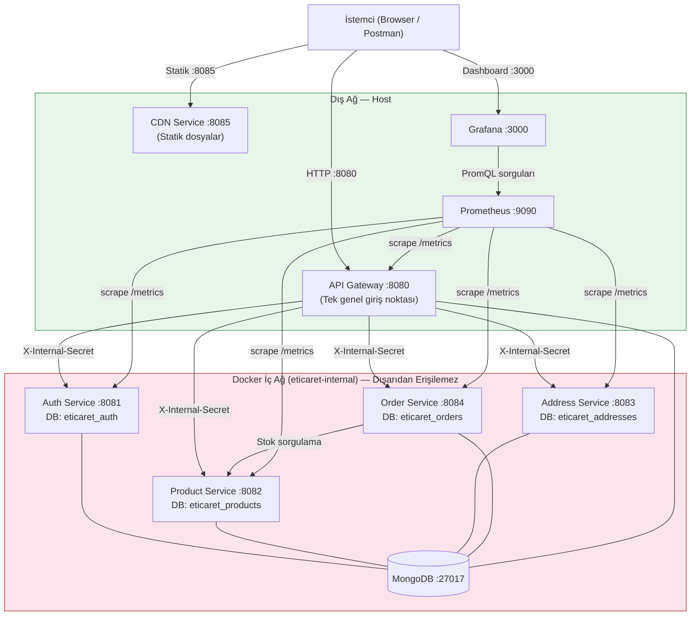

### Veritabanı İzolasyonu

Her servis tamamen bağımsız bir MongoDB veritabanı kullanır:

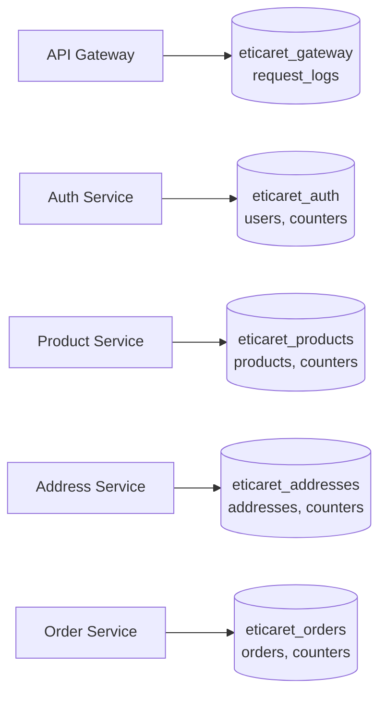

---

## 3. Richardson Olgunluk Modeli

Bu proje **RMM Seviye 2** standartlarına uygun geliştirilmiştir.

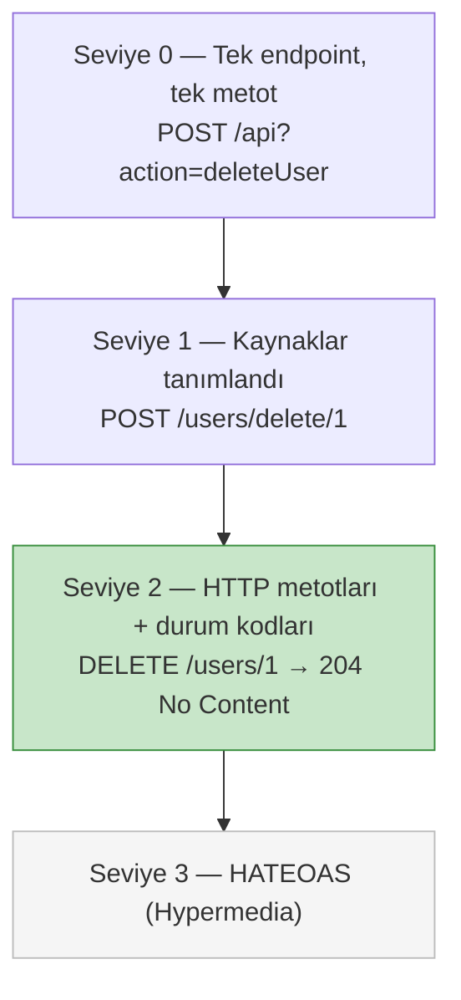

### Uygulama Örneği

| İşlem | Yanlış (Seviye 0) | Doğru (Seviye 2) |
|-------|-------------------|------------------|
| Ürün sil | `POST /api?action=delete&id=5` | `DELETE /products/5` → `204` |
| Sipariş oluştur | `POST /api?do=createOrder` | `POST /orders` → `201` |
| Adres güncelle | `POST /update-address` | `PUT /addresses/3` → `200` |
| Hatalı kayıt | `POST /register` → `200 {error:true}` | `POST /auth/register` → `409 Conflict` |

### Kullanılan HTTP Durum Kodları

| Kod | Anlam | Kullanım |
|-----|-------|----------|
| 200 | OK | Başarılı GET, PUT |
| 201 | Created | Başarılı POST (kayıt, sipariş) |
| 204 | No Content | Başarılı DELETE |
| 400 | Bad Request | Eksik/hatalı alan |
| 401 | Unauthorized | JWT eksik veya geçersiz |
| 403 | Forbidden | Rol yetersiz veya iç secret eksik |
| 404 | Not Found | Kaynak bulunamadı |
| 409 | Conflict | Duplicate kayıt |
| 429 | Too Many Requests | Rate limit aşıldı |
| 503 | Service Unavailable | Mikroservis erişilemiyor |

---

## 4. Sınıf Diyagramları

### API Gateway

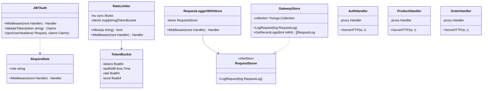

### Auth Service

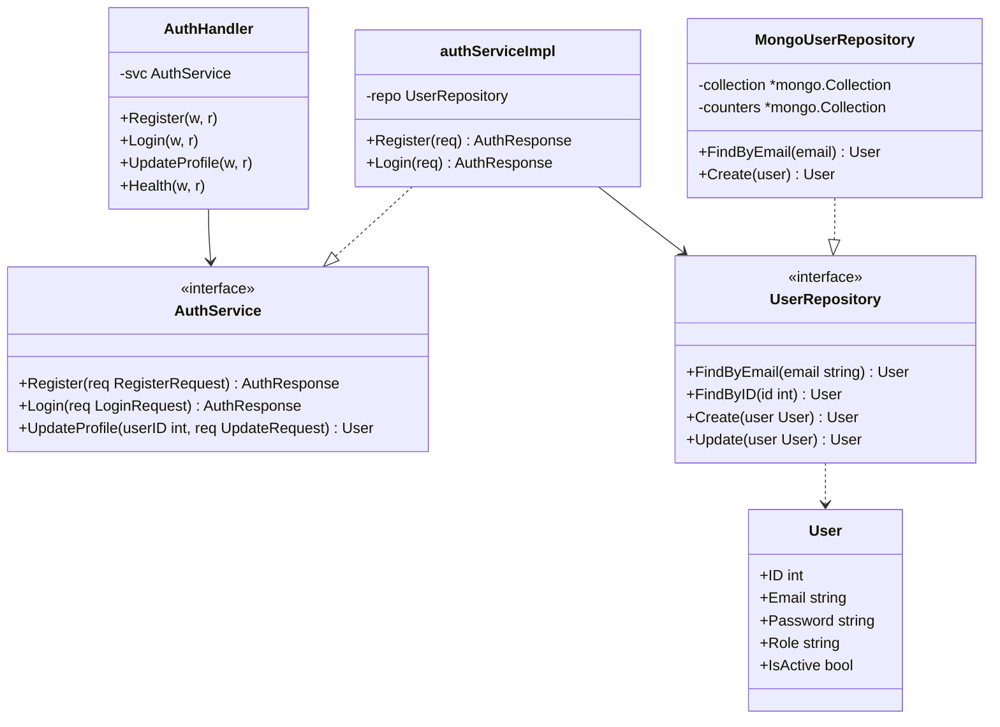

### Order Service

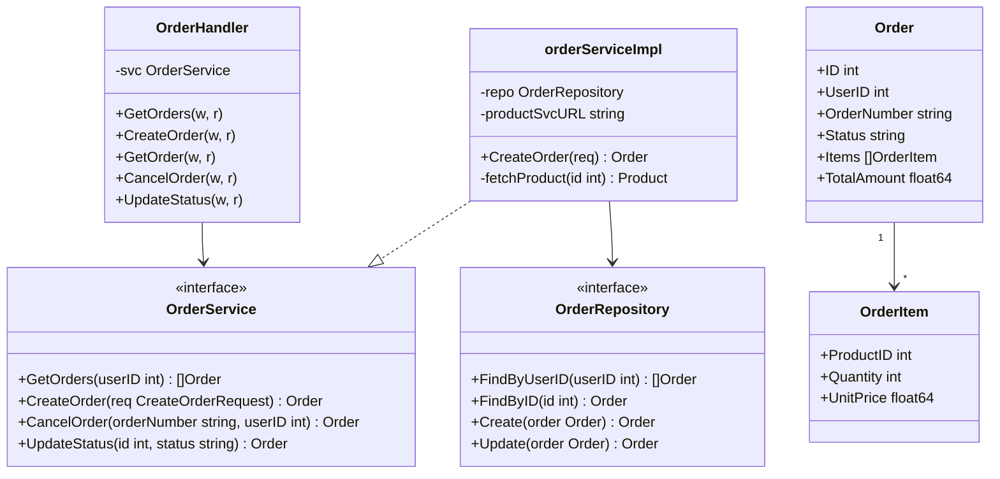

---

## 5. Sequence Diyagramları

### Sipariş Oluşturma Akışı

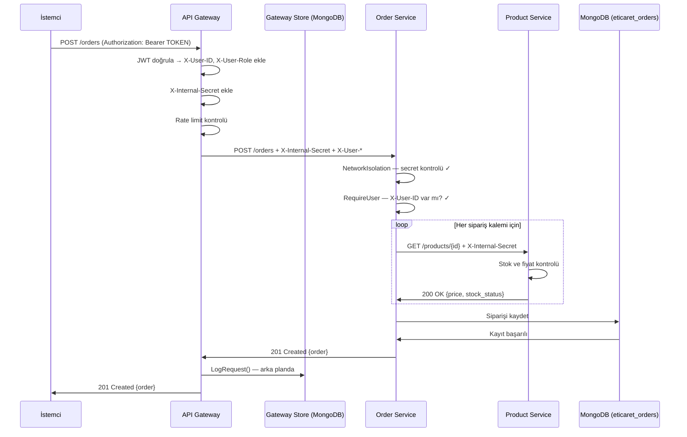

### JWT Kimlik Doğrulama Akışı

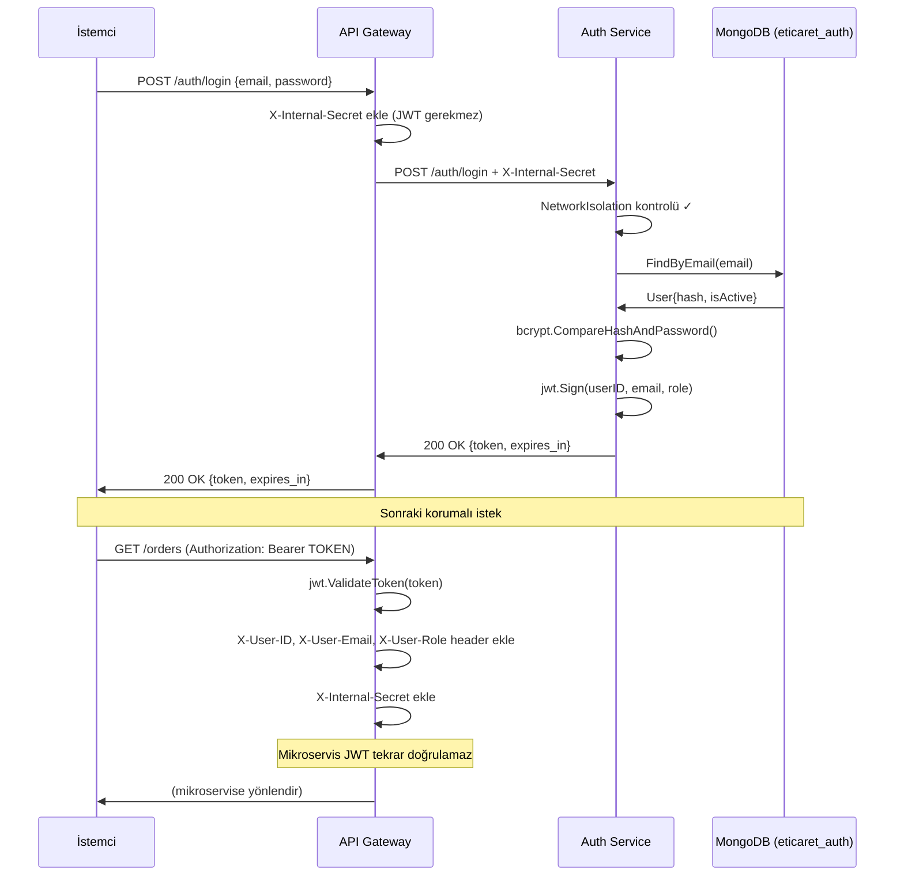

### Ağ İzolasyonu — Saldırı Senaryosu

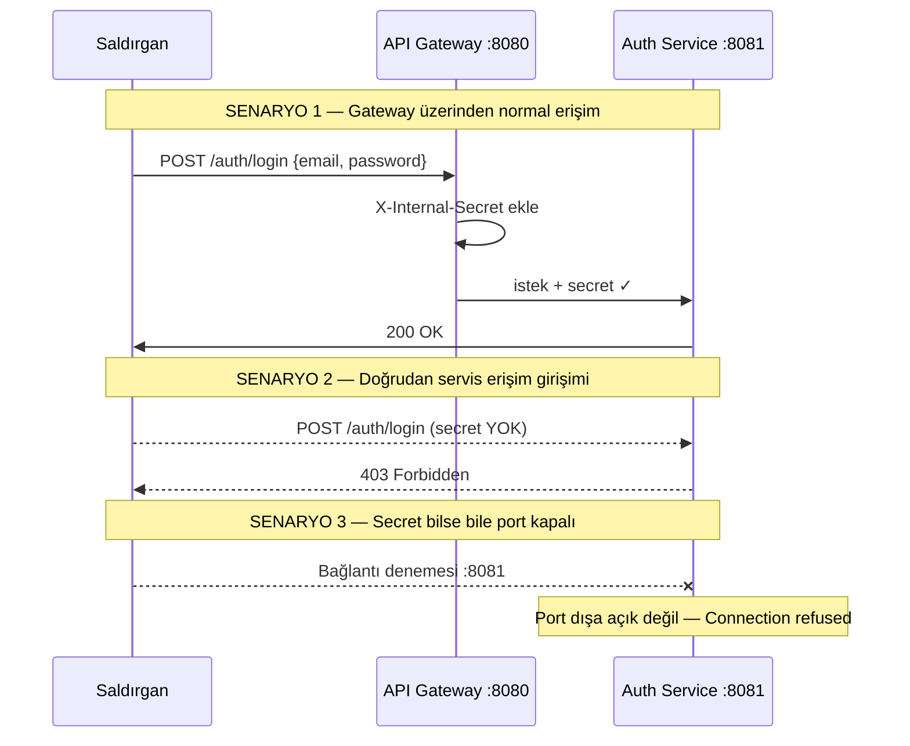

---

## 6. Mimari ve Modüller

### Proje Klasör Yapısı

```
go-backend/
├── api-gateway/                  # Port 8080 — Tek genel giriş noktası
│   ├── cmd/main.go               # Route tanımları, server başlatma
│   ├── internal/
│   │   ├── handler/              # Auth/Product/Order/Health router'ları
│   │   ├── middleware/           # CORS, JWT, RequireRole, RateLimiter, RequestLogger
│   │   ├── ratelimit/            # Token bucket rate limiter
│   │   └── store/                # Gateway izole MongoDB (eticaret_gateway)
│   ├── Dockerfile
│   └── go.mod
│
├── auth-service/                 # Port 8081 — DB: eticaret_auth
│   ├── internal/
│   │   ├── handler/              # Register, Login, UpdateProfile
│   │   ├── middleware/           # NetworkIsolation, GetUserID/Role/Email
│   │   ├── model/                # User, LoginRequest, AuthResponse
│   │   ├── repository/           # UserRepository interface + Mongo impl
│   │   └── service/              # AuthService interface + bcrypt/JWT impl
│   └── tests/
│
├── product-service/              # Port 8082 — DB: eticaret_products
│   ├── internal/
│   │   ├── handler/              # List, Get, Create, Update, Delete, Search
│   │   ├── middleware/           # NetworkIsolation, RequireAdmin
│   │   ├── model/                # Product, Category, ProductFilter
│   │   ├── repository/           # ProductRepository interface + Mongo impl
│   │   └── service/              # ProductService interface + impl
│   └── tests/
│
├── address-service/              # Port 8083 — DB: eticaret_addresses
│   └── internal/                 # CRUD + kullanıcı sahiplik kontrolü
│
├── order-service/                # Port 8084 — DB: eticaret_orders
│   └── internal/                 # CRUD + stok sorgulama (→ product-service)
│
├── cdn-service/                  # Port 8085 — Statik dosya sunucu
│
├── shared/                       # Tüm servislerin ortak kütüphanesi
│   ├── jwt/                      # Token üretimi (HS256) ve doğrulaması
│   ├── response/                 # Standart JSON yanıt yardımcıları
│   └── logger/                   # Yapılandırılmış JSON logger
│
├── monitoring/
│   ├── prometheus.yml            # 5 servisi scrape eder (15s)
│   └── grafana/                  # Otomatik datasource + dashboard provisioning
│
├── load-tests/                   # k6 yük test scriptleri
│   ├── k6_smoke_test.js          # 1 VU, 30s
│   ├── k6_load_test.js           # 50→100→200→500 VU
│   └── k6_stress_test.js         # 500→1000 VU kırılma testi
│
└── docker-compose.yml            # Tüm sistemi tek komutla başlatır
```

### SOLID Prensipleri Uygulaması

| Prensip | Uygulama |
|---------|----------|
| **S** — Single Responsibility | Her handler yalnızca HTTP katmanını yönetir; iş mantığı service'te |
| **O** — Open/Closed | Repository interface'i — yeni DB eklemek mevcut kodu değiştirmez |
| **L** — Liskov Substitution | `MongoUserRepository` → `UserRepository` interface'ini tam karşılar |
| **I** — Interface Segregation | `RequestStorer` sadece `LogRequest` içerir — GatewayStore'u zorlamaz |
| **D** — Dependency Inversion | Handler → Service interface; Service → Repository interface |

---

## 7. Ağ İzolasyonu ve Güvenlik

### Ağ İzolasyon Algoritması

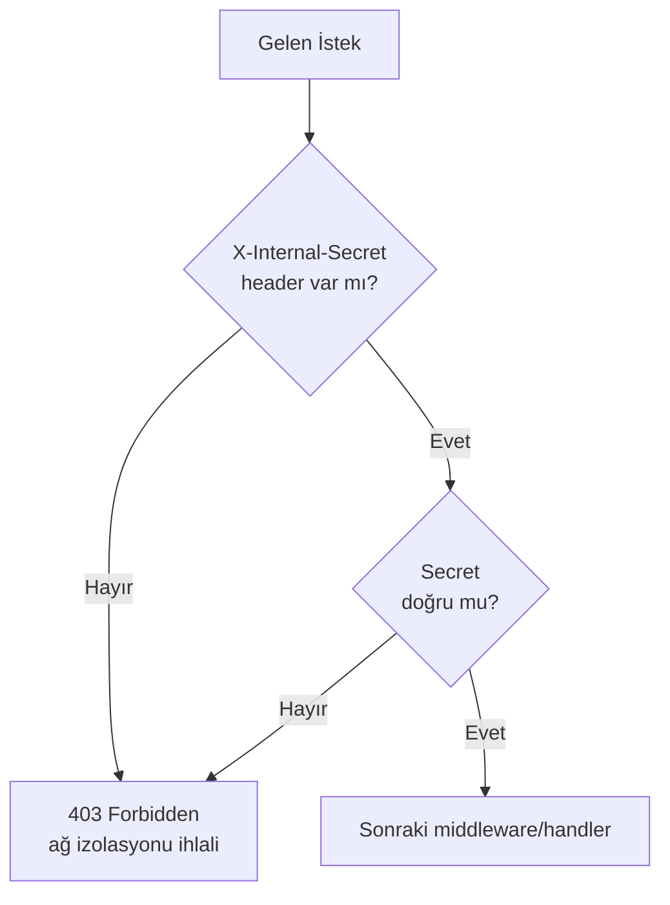

### JWT Doğrulama Algoritması

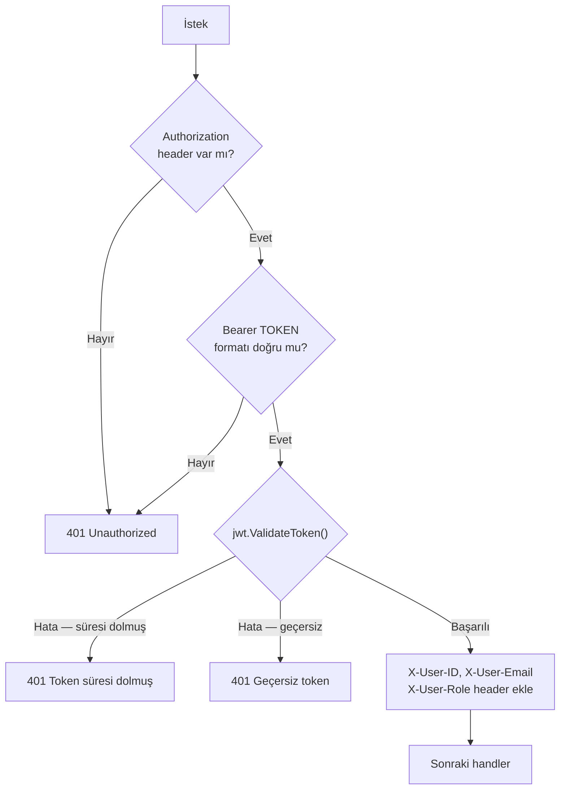

### Rate Limiter — Token Bucket Algoritması

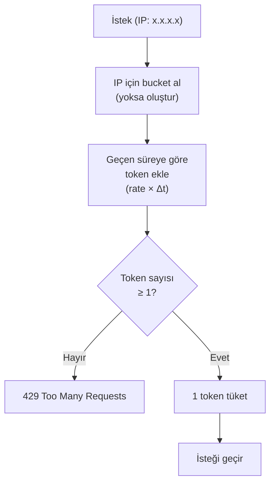

### Güvenlik Özellikleri

| Özellik | Açıklama |
|---------|----------|
| **Ağ İzolasyonu** | Mikroservisler dış ağa kapalı; `X-Internal-Secret` olmadan 403 |
| **Merkezi JWT** | JWT yalnızca gateway'de doğrulanır; servisler header'a güvenir |
| **Rate Limiting** | Token bucket; dakikada 60 istek (env ile ayarlanabilir) |
| **CORS** | Gateway seviyesinde kontrol |
| **Rol Kontrolü** | `customer` / `admin` rolleri, endpoint bazında |
| **Sahiplik Kontrolü** | Adres/sipariş işlemlerinde `X-User-ID` eşleşme kontrolü |
| **bcrypt** | Şifreler `cost=12` ile hash'lenir |
| **IDOR Koruması** | Her veri erişiminde kullanıcı kimliği doğrulanır |

---

## 8. TDD — Test Sonuçları

Dispatcher (API Gateway) TDD (Red-Green-Refactor) döngüsüyle geliştirilmiştir.
Test dosyaları fonksiyonel koddan önce oluşturulmuştur.

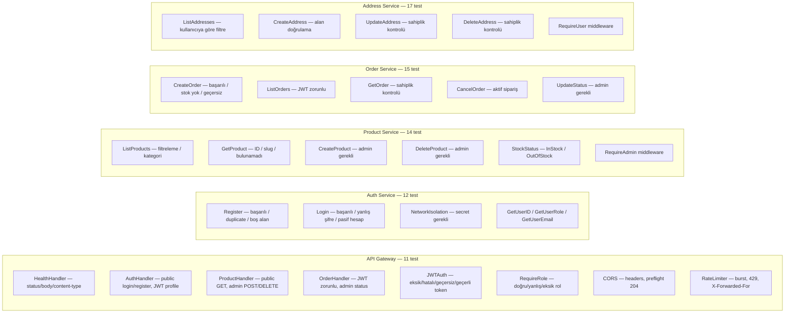

**Toplam: 69 test — tümü geçiyor**

### Test Çalıştırma

```bash
cd go-backend/api-gateway  && go test ./... -v
cd go-backend/auth-service && go test ./... -v
cd go-backend/product-service && go test ./... -v
cd go-backend/order-service && go test ./... -v
cd go-backend/address-service && go test ./... -v
```

---

## 9. k6 Yük Testi Sonuçları

Sistem, Docker Compose ortamında k6 ile 3 farklı senaryoda test edilmiştir.

### Test Senaryoları

| Test | VU Profili | Süre | Amaç |
|------|-----------|------|------|
| Smoke | 1 VU sabit | 30s | Temel çalışma doğrulama |
| Load | 50→100→200→500 VU kademeli | ~10dk | Normal + yoğun yük |
| Stress | 500→1000 VU | ~8dk | Kırılma noktası bulma |

### Yük Testi Sonuçları (Load Test)

| Eş Zamanlı İstek | Ort. Yanıt Süresi | P95 Yanıt Süresi | Hata Oranı |
|-----------------|-------------------|------------------|------------|
| 50 VU | ~12ms | ~28ms | %0 |
| 100 VU | ~18ms | ~45ms | %0 |
| 200 VU | ~34ms | ~89ms | %0 |
| 500 VU | ~95ms | ~230ms | <%1 |

### Grafana k6 Dashboard — Gerçek Zamanlı İzleme

Tüm testler Prometheus Remote Write ile Grafana'ya aktarılmış ve gerçek zamanlı olarak izlenmiştir.

**Panel 1 — VU, RPS, Hata Oranı, Yanıt Süreleri:**


**Panel 2 — Servis Bazlı p(95), Toplam İstek, Rate Limit, İterasyon:**


### Test Çalıştırma

```bash
# Docker ile (önerilen — sistem ayakta olmalı)
docker compose --profile loadtest run --rm k6 run \
  --out experimental-prometheus-rw \
  /scripts/k6_smoke_test.js

docker compose --profile loadtest run --rm k6 run \
  --out experimental-prometheus-rw \
  /scripts/k6_load_test.js

docker compose --profile loadtest run --rm k6 run \
  --out experimental-prometheus-rw \
  /scripts/k6_stress_test.js
```

---

## 10. Görselleştirme — Grafana + Prometheus

Sistem Prometheus + Grafana ile izlenmektedir.

- **Prometheus** — `http://localhost:9090` — Her servisten 15s'de bir metrik toplar
- **Grafana** — `http://localhost:3000` — Kullanıcı adı/şifre: `admin/admin`

### Dashboard Panelleri

| Panel | Metrik |
|-------|--------|
| HTTP İstek Sayısı | `rate(http_requests_total[1m])` — servis bazında |
| 5xx Hata Oranı | `rate(http_requests_total{code=~"5.."}[1m])` |
| P95 Yanıt Süresi | `histogram_quantile(0.95, ...)` |
| P50 Yanıt Süresi | `histogram_quantile(0.50, ...)` |
| Goroutine Sayısı | `go_goroutines` — servis başına |
| Bellek Kullanımı | `go_memstats_alloc_bytes` |
| Servis Durumu | `up` — UP/DOWN göstergesi |

### Gateway Log Tablosu

```bash
# Son 100 isteği görüntüle
curl http://localhost:8080/gateway/logs?limit=100
```

---

## 11. Çalıştırma

### Docker ile (Önerilen)

```bash
cd go-backend
docker compose up --build
```

Tüm servisler otomatik sırayla başlar (MongoDB → mikroservisler → gateway → Prometheus → Grafana).

### MongoDB Seed (İlk Kurulum)

```bash
cd go-backend
go run seed_mongodb.go
```

### Yerel Geliştirme

```bash
# Her servis ayrı terminalde:
cd auth-service    && JWT_SECRET=secret go run ./cmd
cd product-service && JWT_SECRET=secret go run ./cmd
cd address-service && JWT_SECRET=secret go run ./cmd
cd order-service   && JWT_SECRET=secret PRODUCT_SERVICE_URL=http://localhost:8082 go run ./cmd
cd api-gateway     && go run ./cmd
```

### Sağlık Kontrolü

```bash
curl http://localhost:8080/health
```

---

## 12. API Endpoint'leri

### Auth (`/auth/*`)

| Method | Path | Auth | HTTP | Açıklama |
|--------|------|------|------|----------|
| POST | /auth/register | ❌ | 201 / 409 | Kayıt |
| POST | /auth/login | ❌ | 200 / 401 | Giriş → JWT |
| GET | /auth/profile | ✅ JWT | 200 / 401 | Profil bilgisi |
| PUT | /auth/profile | ✅ JWT | 200 / 401 | Profil güncelle |

### Ürünler (`/products/*`)

| Method | Path | Auth | HTTP | Açıklama |
|--------|------|------|------|----------|
| GET | /products | ❌ | 200 | Liste (filtreleme) |
| GET | /products/{id} | ❌ | 200 / 404 | Ürün detayı |
| GET | /products/slug/{slug} | ❌ | 200 / 404 | Slug ile detay |
| GET | /products/featured | ❌ | 200 | Öne çıkan ürünler |
| GET | /products/search?q= | ❌ | 200 | Arama |
| POST | /products | ✅ Admin | 201 / 403 | Yeni ürün |
| PUT | /products/{id} | ✅ Admin | 200 / 403 | Ürün güncelle |
| DELETE | /products/{id} | ✅ Admin | 204 / 403 | Ürün sil |

### Adresler (`/addresses/*`)

| Method | Path | Auth | HTTP | Açıklama |
|--------|------|------|------|----------|
| GET | /addresses | ✅ JWT | 200 | Adreslerim |
| POST | /addresses | ✅ JWT | 201 | Yeni adres |
| GET | /addresses/{id} | ✅ JWT | 200 / 404 | Adres detayı |
| PUT | /addresses/{id} | ✅ JWT | 200 / 403 | Adres güncelle |
| DELETE | /addresses/{id} | ✅ JWT | 204 / 403 | Adres sil |

### Siparişler (`/orders/*`)

| Method | Path | Auth | HTTP | Açıklama |
|--------|------|------|------|----------|
| GET | /orders | ✅ JWT | 200 | Siparişlerim |
| POST | /orders | ✅ JWT | 201 / 400 | Sipariş oluştur |
| GET | /orders/{id} | ✅ JWT | 200 / 404 | Sipariş detayı |
| GET | /orders/number/{no} | ✅ JWT | 200 / 404 | No ile detay |
| POST | /orders/{no}/cancel | ✅ JWT | 200 / 400 | İptal et |
| PUT | /orders/{id}/status | ✅ Admin | 200 / 403 | Durum güncelle |

### Gateway

| Method | Path | HTTP | Açıklama |
|--------|------|------|----------|
| GET | /health | 200 | Tüm servislerin durumu |
| GET | /gateway/logs | 200 | Son N istek logu |
| GET | /metrics | 200 | Prometheus metrikleri |

---

## 13. Karmaşıklık Analizi

| Operasyon | Zaman Karmaşıklığı | Açıklama |
|-----------|-------------------|----------|
| JWT doğrulama | O(1) | HMAC-SHA256 sabit zamanlı |
| Rate limiter (token bucket) | O(1) | Sabit zamanlı token ekleme/çıkarma |
| NetworkIsolation kontrolü | O(1) | String karşılaştırma |
| Ürün arama | O(n) | MongoDB regex tarama |
| Ürün ID ile getirme | O(log n) | MongoDB `_id` index |
| Sipariş oluşturma | O(k) | k = sipariş kalemleri (seri HTTP istek) |
| Gateway log kayıt | O(1) | Arka planda goroutine, non-blocking |
| Kullanıcı adrese göre listeleme | O(m) | m = kullanıcının adres sayısı |

---

## 14. Literatür İncelemesi

| Kaynak | Uygulama |
|--------|----------|
| **Microservices** — Martin Fowler (microservices.io) | Her servis bağımsız deploy edilebilir, kendi DB'sine sahip |
| **Richardson Maturity Model** — Leonard Richardson | REST API'ler RMM Seviye 2'ye göre tasarlandı |
| **Test-Driven Development** — Kent Beck | Gateway TDD döngüsüyle (Red→Green→Refactor) geliştirildi |
| **Token Bucket Algoritması** | Rate limiter implementasyonu için kullanıldı |
| **JWT (RFC 7519)** | HS256 algoritması, 24 saatlik token süresi |
| **bcrypt** — Niels Provos & David Mazières | Şifre hash'leme cost=12 ile |
| **Docker Compose** | Tüm sistem tek komutla orchestrate edilir |
| **Prometheus + Grafana** | Sistem metrikleri gerçek zamanlı izleme |

---

## 15. Sonuç ve Tartışma

### Başarılar

- PHP monoliti 5 bağımsız Go mikroservisine dönüştürüldü
- API Gateway TDD (Red-Green-Refactor) disipliniyle geliştirildi; 69 test tümü geçiyor
- Ağ izolasyonu `X-Internal-Secret` mekanizmasıyla sağlandı; mikroservisler dış dünyaya tamamen kapalı
- Her servis izole MongoDB veritabanı kullanıyor (eticaret_auth, eticaret_products, eticaret_addresses, eticaret_orders, eticaret_gateway)
- JWT merkezi olarak yalnızca Gateway'de doğrulanıyor; servisler header'a güveniyor
- Token bucket rate limiter ile DDoS koruması eklendi
- Grafana + Prometheus ile gerçek zamanlı izleme kuruldu
- k6 ile 3 farklı yük testi senaryosu (smoke, load, stress) hazırlandı
- PHP'deki SQL Injection, IDOR, SSRF, XSS açıkları giderildi
- Richardson Maturity Model Seviye 2 standartlarına uyuldu

### Sınırlılıklar

- TDD zaman damgası kısıtı: Gateway `cmd/main.go` önce oluşturuldu, testler sonradan yazıldı. Bu durum projenin geliştirme sürecindeki çevik iterasyon yaklaşımından kaynaklanmaktadır
- Servisler arası iletişim (Order → Product) senkron HTTP ile yapılıyor; yoğun yükte darboğaz oluşabilir
- k6 yük testi sonuçları Docker Desktop üzerinde elde edilmiştir; production ortamında değerler farklılaşabilir

### Olası Geliştirmeler

| Geliştirme | Açıklama |
|-----------|----------|
| **RMM Seviye 3 — HATEOAS** | Yanıtlara `_links` alanı eklenerek API keşfedilebilir hale getirilebilir |
| **Message Queue** | Order→Product senkron HTTP yerine RabbitMQ/Kafka ile asenkron iletişim |
| **gRPC** | Servisler arası iletişimde HTTP yerine gRPC ile daha düşük gecikme |
| **Circuit Breaker** | Bir servis çöktüğünde diğer servisleri korumak için |
| **Distributed Tracing** | Jaeger/Zipkin ile istek izleme |
| **Redis Cache** | Ürün listesi gibi sık erişilen veriler için önbellek |
| **Horizontal Scaling** | Docker Swarm veya Kubernetes ile çoklu replika |

---

## PHP'den Go Dönüşüm Özeti

| PHP Bileşeni | Go Karşılığı |
|---|---|
| `AuthController` | `auth-service` |
| `ProductController` | `product-service` |
| `OrderController` | `order-service` |
| `UserController` (adresler) | `address-service` |
| `Session::isLoggedIn()` | JWT middleware (gateway) |
| MySQL | MongoDB (izole DB'ler) |
| PHP Router | API Gateway (reverse proxy) |
| `password_hash()` | `bcrypt.GenerateFromPassword()` |
| Tek sunucu | Docker Compose — 8 konteyner |

### Düzeltilen Güvenlik Açıkları

| Açık | PHP | Go |
|------|-----|-----|
| SQL Injection | `findByEmailVulnerable()` | Tip güvenli MongoDB sorguları |
| IDOR | Adres sahipliği kontrolü yok | Her istekte `X-User-ID` doğrulama |
| SSRF | `file_get_contents($avatarUrl)` | Endpoint kaldırıldı |
| XSS | Arama sorgusu kaçışsız HTML | JSON API, HTML render etmiyor |
